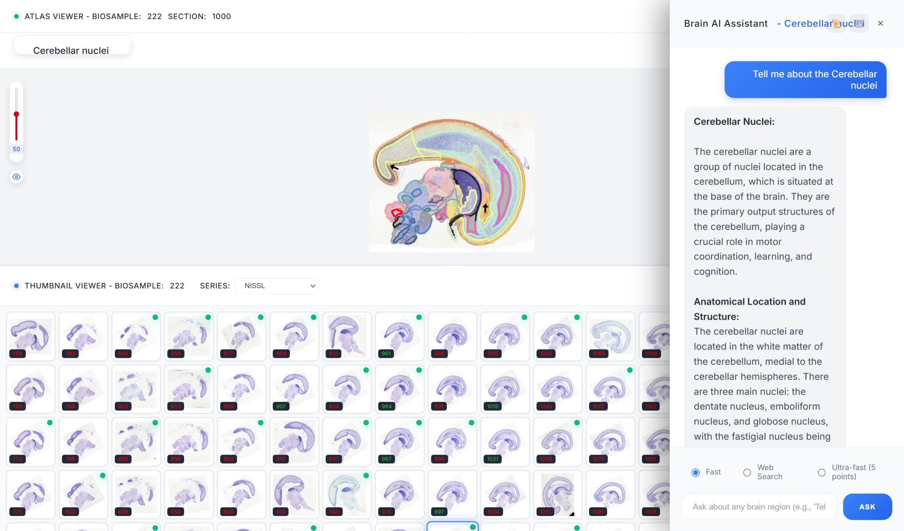

# Brain Assistant Application

A comprehensive brain atlas viewer with AI-powered assistant that provides interactive brain exploration, streaming responses, and 5-point summaries.



## 🧠 Overview

This application combines a sophisticated brain atlas viewer with an advanced AI-powered chatbot assistant to provide an immersive brain exploration experience. Users can view brain sections, interact with anatomical regions, and get detailed information with streaming 5-point summaries through natural language conversations.

## 🏗️ Project Structure

```
brain_assistant/
├── README.md                           # Main project documentation
├── local/                              # Production Flask application
│   ├── app.py                          # Main Flask server with streaming support
│   ├── requirements.txt                # Flask app dependencies
│   ├── README.md                       # Local app documentation
│   ├── static/                         # Frontend assets
│   │   ├── script.js                   # Main JavaScript with streaming logic
│   │   └── style.css                   # Complete styling with themes
│   ├── templates/
│   │   └── index.html                  # Main UI template
│   └── test.txt                        # Test configurations
├── src/                                # Core AI assistant modules
│   ├── brain_region_assistant.py       # Basic AI assistant implementation
│   ├── brain_region_assistant_langchain.py  # Advanced LangChain-based assistant
│   ├── requirements.txt                # AI assistant dependencies
│   └── app/                            # Alternative Flask implementation
│       ├── app.py                      # Secondary Flask server
│       ├── requirements.txt            # App specific dependencies
│       ├── static/
│       │   ├── css/style.css           # Styling
│       │   ├── images/                 # Image assets
│       │   └── js/app.js               # JavaScript functionality
│       └── templates/index.html        # Alternative UI template
└── volume/                             # Data storage directory
```

## ✨ Key Features

### 🧠 Interactive Brain Atlas Viewer
- **High-Resolution Images**: Smooth zoom/pan with IIIF image server
- **Interactive Annotations**: Click brain regions for AI-powered explanations
- **Adjustable Overlays**: Opacity control for annotation layers with eye toggle
- **Resizable Panels**: Drag-to-resize between atlas and thumbnail viewers
- **Region Highlighting**: Visual feedback for selected anatomical structures

### 🖼️ Advanced Thumbnail System
- **Dual-Grid Layout**: Two synchronized thumbnail grids for navigation
- **Series Support**: Multiple staining types (NISSL, H&E, Block Face, Myelin)
- **Smart Caching**: Optimized thumbnail loading and caching
- **Visual Selection**: Clear indication of current section

### 🤖 AI-Powered Brain Assistant with Streaming
- **Real-time Streaming**: Live text generation with immediate response
- **5-Point Summaries**: Automatic key point summaries for all responses
- **Three Response Modes**: 
  - **Fast**: Quick responses with local AI
  - **Detailed (Web)**: Enhanced with web search integration
  - **Ultra-fast**: Bullet-point format responses
- **Contextual Memory**: Maintains conversation history and context
- **Chat History**: Persistent conversation tracking with download options
- **Resizable Interface**: Drag-to-resize chatbot width with localStorage persistence

### 🎨 Modern UI/UX
- **Dark/Light Themes**: Toggle with system preference detection
- **Glassmorphism Design**: Modern visual effects and animations
- **Responsive Layout**: Adapts to different screen sizes and orientations  
- **Smooth Animations**: 240Hz display optimized transitions
- **Accessibility**: Keyboard navigation and screen reader support

## 🛠️ Technical Stack

### Backend Architecture
- **Flask 2.3.3**: Modern Python web framework
- **SQLAlchemy 2.0.21**: Advanced ORM with MySQL integration
- **Server-Sent Events**: Real-time streaming responses
- **Session Management**: Flask sessions with conversation persistence
- **Caching System**: Multi-level caching (GeoJSON, thumbnails, responses)

### AI/ML Components (`src/brain_region_assistant_langchain.py`)
The core AI assistant is implemented in `src/brain_region_assistant_langchain.py`, featuring:

#### **🧠 UltraFastBrainAssistant Class**
Advanced LangChain-based AI assistant with comprehensive brain region expertise:

- **Multi-Model Integration**: Supports Llama-3.3-70B-Instruct, OpenAI GPT models
- **Streaming Responses**: Real-time text generation with chunked delivery
- **5-Point Summary Generation**: Automatic key point extraction for all responses
- **Three Response Modes**:
  - `fast`: Quick local LLM responses
  - `web`: Enhanced with web search integration  
  - `ultra`: Bullet-point format for rapid insights

#### **🔍 QueryAnalyzer Class**
Intelligent query categorization and optimization:

- **Query Type Detection**: Automatically identifies query categories:
  - `recent_research`: Latest findings and studies
  - `clinical`: Treatment, therapy, disorders
  - `anatomical`: Structure, location, components
  - `functional`: Roles, purposes, responsibilities
  - `connectivity`: Pathways, networks, circuits
  - `developmental`: Growth, formation, maturation
- **Complexity Assessment**: Dynamic source allocation based on query complexity
- **Source Prioritization**: Optimizes search strategy per query type
- **Cache TTL Management**: Smart caching based on content freshness needs

#### **🛡️ ErrorHandler Class**
Comprehensive error management and recovery:

- **Multi-Strategy Recovery**: Timeout, network, parsing error handling
- **Error Logging**: Maintains error history with rotation
- **Graceful Degradation**: Fallback mechanisms for service failures
- **Performance Monitoring**: Tracks response times and success rates

#### **🌐 EnhancedWebSearch Class**
Advanced web search with intelligent source selection:

- **Multi-Source Integration**: Wikipedia, DuckDuckGo, specialized databases
- **Concurrent Processing**: Parallel search execution with ThreadPoolExecutor
- **Result Quality Scoring**: Content relevance and authority assessment
- **Adaptive Source Selection**: Dynamic source prioritization
- **Rate Limiting**: Respectful API usage with built-in throttling

#### **🔄 Streaming Implementation**
Real-time response delivery system:

- **Chunk-Based Streaming**: Optimized chunk sizes for smooth delivery
- **Summary Streaming**: Live generation of 5-point summaries
- **Error Recovery**: Graceful handling of streaming interruptions
- **Memory Management**: Efficient buffer handling for long responses

#### **💾 Advanced Caching System**
Multi-level caching for optimal performance:

- **Region Cache**: Brain region information with TTL management
- **Conversation History**: Contextual conversation tracking
- **LRU Eviction**: Memory-efficient cache management
- **Cache Invalidation**: Smart cache refresh strategies

#### **📊 Performance Features**
- **Concurrent Processing**: Multi-threaded search and processing
- **Response Optimization**: Intelligent content prioritization  
- **Memory Efficiency**: Optimized data structures and algorithms
- **Monitoring**: Built-in performance metrics and logging

### Frontend Technologies
- **OpenLayers 5.3.0**: Interactive map rendering for brain atlas
- **Vanilla JavaScript ES6+**: Modern JavaScript with async/await
- **CSS3 Grid/Flexbox**: Advanced layout with custom properties
- **HTML5 Semantic**: Accessibility-focused markup
- **Streaming APIs**: Fetch API with ReadableStream for real-time updates

### External Services
- **MySQL Database**: Brain metadata and annotation storage (HBA_V2)
- **IIIF Image Server**: High-performance image serving (IIPSrv)
- **Apollo2 Infrastructure**: Image and data hosting
- **LLM Endpoints**: Multiple AI model endpoints for redundancy

## 🚀 Installation & Setup

### Prerequisites
- Python 3.8+
- MySQL database access
- Network access to external APIs and image servers

### Quick Start

1. **Clone Repository**:
```bash
git clone <repository-url>
cd brain_assistant
```

2. **Install Core Dependencies**:
```bash
# Install AI assistant dependencies
cd src/
pip install -r requirements.txt

# Install Flask app dependencies  
cd ../local/
pip install -r requirements.txt
```

3. **Configure Environment**:
```bash
# Set up database connection in local/app.py
# Update MySQL credentials and endpoints
```

4. **Run Application**:
```bash
cd local/
python app.py
```

5. **Access Application**:
```
http://localhost:5006
```

## 📖 Usage Guide

### Atlas Viewer Navigation
- **Zoom**: Mouse wheel or pinch gestures
- **Pan**: Click and drag to navigate
- **Region Selection**: Click on brain regions to activate chatbot
- **Opacity Control**: Left sidebar slider (0-99%)
- **Annotations Toggle**: Eye icon to show/hide overlays
- **Panel Resize**: Drag handle between atlas and thumbnail panels

### Thumbnail Navigation
- **Section Selection**: Click thumbnails to load sections
- **Series Selection**: Dropdown for staining types
- **Dual Scrolling**: Two synchronized thumbnail grids
- **Visual Feedback**: Selected section highlighted

### AI Assistant Interface
- **Activation**: Automatic on region selection or manual toggle
- **Mode Selection**: Choose between Fast/Detailed/Ultra-fast
- **Streaming Chat**: Real-time response generation
- **Summary Display**: Automatic 5-point summaries
- **History Management**: View, clear, or download chat history
- **Resize Chat**: Drag left edge to adjust chatbot width

### Advanced Features
- **URL Parameters**: `?biosample=222&section=1000&series=NISSL`
- **Keyboard Shortcuts**: Enter to send, Escape to close
- **Theme Switching**: Persistent dark/light mode
- **Chat Export**: Download conversation history as JSON

## 🔧 Configuration

### Database Configuration
```python
# local/app.py
MySQL_db_user = "root"
MySQL_db_password = "Health#123" 
MySQL_db_host = "apollo2.humanbrain.in"
MySQL_db_port = "3306"
MySQL_db_name = "HBA_V2"
```

### AI Model Settings
```python
# src/brain_region_assistant_langchain.py
model_name = "Llama-3.3-70B-Instruct"
base_url = "http://dgx5.humanbrain.in:8999/v1"
max_tokens = 2000
temperature = 0.1
streaming = True
```

### Image Server URLs
```python
base_url = "http://dgx3.humanbrain.in:10603"
image_server = "https://apollo2.humanbrain.in/iipsrv"
geojson_base = "https://apollo2.humanbrain.in/iipsrv/ddn/storageIIT"
```

## 📡 API Reference

### Viewer Endpoints
- `GET /` - Main application interface
- `POST /api/geojson` - GeoJSON annotation data
- `POST /api/thumbnails` - Thumbnail grid data
- `POST /api/light-weight-viewer` - Viewer configuration

### AI Assistant Endpoints
- `POST /api/brain-region-stream` - Stream brain region information
- `POST /api/ask-question-stream` - Stream question responses
- `GET /api/chat-history` - Get conversation history
- `DELETE /api/chat-history` - Clear conversation history

### Request/Response Examples

#### Brain Region Stream Request
```json
{
  "region": "Hippocampus",
  "mode": "web"
}
```

#### Streaming Response Format
```
data: {"chunk": "The hippocampus is a major component...", "success": true}
data: {"chunk": "\n\n**🔑 Key Summary:**\n1. Location...", "success": true}  
data: {"complete": true, "region": "Hippocampus"}
```

## 🔍 Performance Optimization

### Caching Strategy
- **Multi-level Caching**: GeoJSON, thumbnails, and AI responses
- **Smart Cache Keys**: Region-mode combination keys
- **TTL Management**: Configurable cache expiration
- **Memory Management**: LRU cache eviction

### Streaming Optimization
- **Chunked Responses**: Progressive content delivery
- **Buffer Management**: Optimal chunk sizes for smooth streaming
- **Connection Pooling**: Efficient database and API connections
- **Image Optimization**: IIIF protocol for efficient image serving

## 🛡️ Security & Privacy

### Data Security
- **Input Sanitization**: All user inputs validated and sanitized
- **SQL Injection Protection**: Parameterized queries throughout
- **XSS Prevention**: Proper output encoding
- **Session Security**: Secure session management with Flask-Session

### API Security
- **CORS Configuration**: Proper cross-origin resource sharing
- **Rate Limiting**: Protection against abuse
- **Error Handling**: Secure error responses without information disclosure
- **Authentication Ready**: Framework for user authentication

## 🧪 Testing & Development

### Development Setup
```bash
# Enable debug mode
export FLASK_DEBUG=true
export FLASK_ENV=development
python app.py
```

### Testing Checklist
- [ ] Atlas viewer zoom/pan functionality
- [ ] Thumbnail navigation and selection
- [ ] AI assistant streaming responses
- [ ] Theme switching persistence
- [ ] Chat history management
- [ ] Responsive design on mobile
- [ ] Browser compatibility (Chrome, Firefox, Safari, Edge)

## 🚀 Deployment

### Production Configuration
```python
# Production settings
DEBUG = False
TESTING = False
SECRET_KEY = os.environ.get('SECRET_KEY', 'change-in-production')
```

### Docker Deployment
```dockerfile
FROM python:3.9-slim
WORKDIR /app
COPY local/requirements.txt .
RUN pip install -r requirements.txt
COPY local/ .
EXPOSE 5006
CMD ["python", "app.py"]
```

### Environment Variables
```bash
FLASK_SECRET_KEY=your-secret-key
MYSQL_PASSWORD=your-db-password  
OPENAI_API_KEY=your-openai-key
LLM_ENDPOINT=your-llm-endpoint
```

## 🔮 Future Enhancements

### Planned Features
1. **Enhanced AI Capabilities**:
   - Multi-modal input (images, audio)
   - Comparative region analysis
   - Research paper integration

2. **Advanced Visualization**:
   - 3D brain rendering
   - Interactive pathway tracing
   - Multi-scale visualization

3. **Collaboration Features**:
   - Real-time multi-user sessions
   - Annotation sharing
   - Expert consultation

4. **Mobile & Offline**:
   - Native mobile apps
   - Progressive Web App (PWA)
   - Offline capability with IndexedDB

## 🤝 Contributing

### Development Workflow
1. Fork the repository
2. Create feature branch (`git checkout -b feature/amazing-feature`)
3. Commit changes (`git commit -m 'Add amazing feature'`)
4. Push to branch (`git push origin feature/amazing-feature`)
5. Open Pull Request

### Code Standards
- **Python**: Follow PEP 8, use type hints
- **JavaScript**: ES6+, consistent naming conventions
- **CSS**: BEM methodology, responsive design first
- **Documentation**: Comprehensive docstrings and comments

## 📞 Support & Issues

### Troubleshooting
- **Database Issues**: Check MySQL connectivity and credentials
- **Image Loading**: Verify IIIF server accessibility
- **AI Responses**: Confirm LLM endpoint availability
- **Streaming Problems**: Check network stability and browser compatibility

### Getting Help
- Review error logs in browser console
- Check Flask application logs
- Verify all external service endpoints
- Test with minimal configuration

## 📄 License

This project is developed for research and educational purposes. Please respect all applicable licenses and terms of use for external services and data sources.

---

**Version**: 2.0  
**Last Updated**: August 2025  
**Maintainer**: Brain Assistant Development Team
